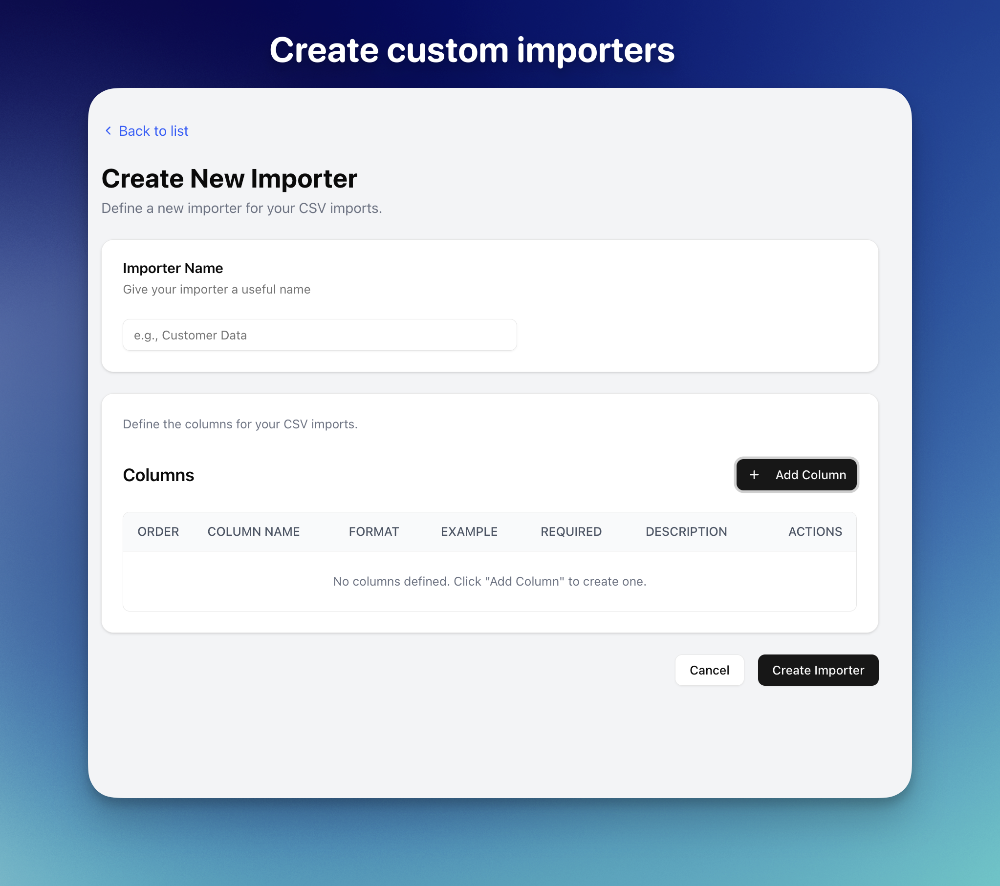
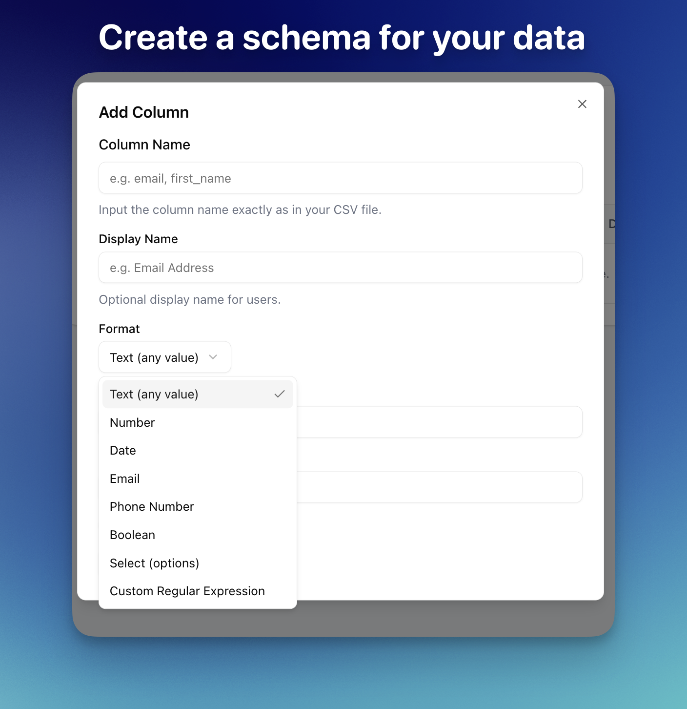
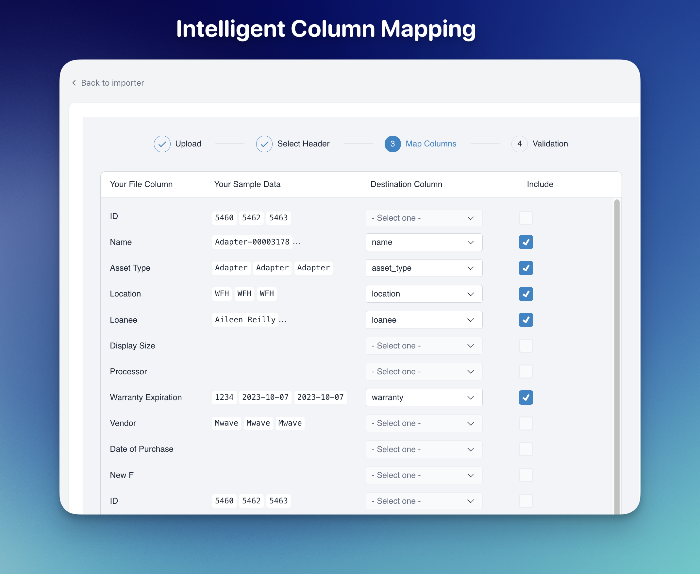
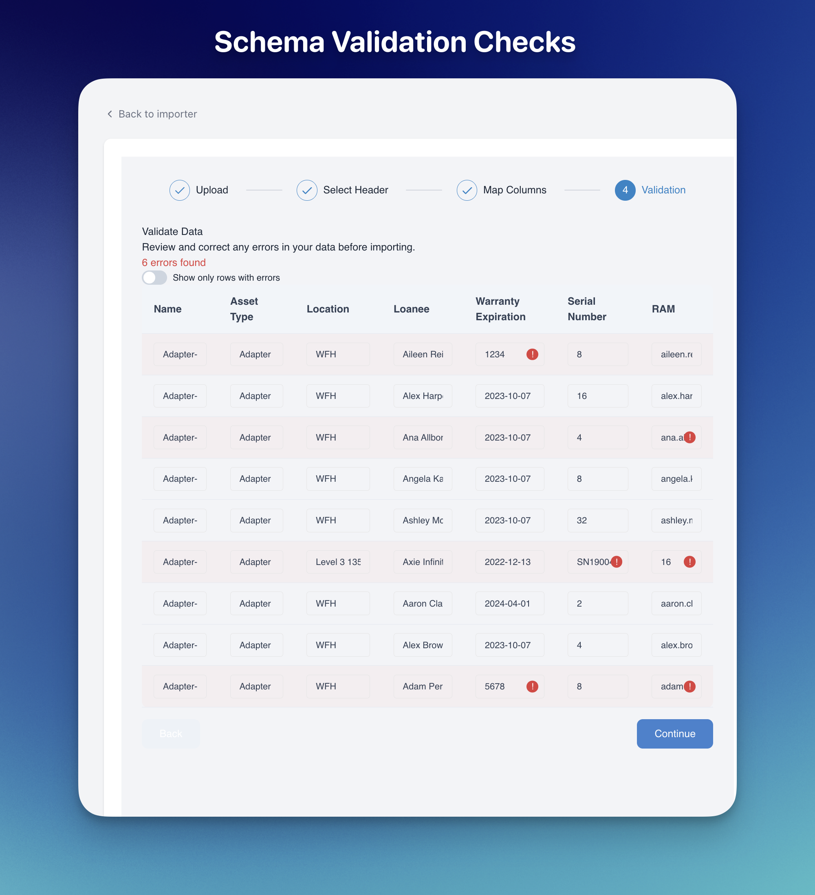
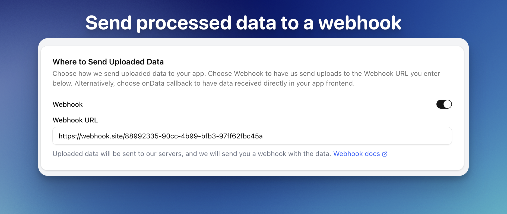

<div align="center">

# ⚡ ImportCSV: Open Source CSV Importer

<p align="center">
  <strong>The open-source CSV import solution for modern web applications</strong>
</p>

<p align="center">
  <em>Import rows in seconds with intelligent column mapping and validation</em>
</p>

[](LICENSE)
[](https://importcsv.slack.com)

<p align="center">
  <a href="#key-features">Features</a> •
  <a href="#quick-start">Quick Start</a> •
  <a href="#documentation">Docs</a> •
  <a href="#demo">Demo</a> •
  <a href="#contributing">Contributing</a>
</p>

<div align="center">
  
  
  
  
  
</div>

</div>

Quick Demo available [here](https://screen.studio/share/8STvmqkq).

## 🚀 Why ImportCSV?

Data importing is a critical but challenging part of any business application. ImportCSV solves this with a **production-ready**, **fully customizable** solution that handles the entire CSV import workflow:

- 📊 **Simple UI** - Polished, responsive interface for uploading and mapping data
- 🔄 **Intelligent Mapping** - Automatically matches columns to your schema
- ⚡ **High Performance** - Process millions of rows with background queue processing
- 🔌 **Easy Integration** - Drop-in React components for any web application
- 🔒 **Secure** - Built-in authentication and data validation

> **Note**: ImportCSV was built on [TableFlow's CSV Import](https://github.com/tableflowhq/csv-import) foundation and enhanced with enterprise-grade features.

## ✨ Key Features

- **Smart Column Mapping** - AI-powered matching of source columns to destination fields
- **Multi-Format Support** - Import from CSV, XLS, XLSX, and TSV files
- **Scalable Processing** - Redis Queue for handling large imports in the background
- **Secure Authentication** - JWT-based auth with automatic token refresh
- **Embeddable Components** - React SDK for seamless integration into any app
- **Comprehensive Validation** - Client and server-side validation with detailed feedback
- **Webhook Integration** - Connect with your existing systems and workflows
- **Customizable UI** - Tailor the interface to match your application's design

## 🏗️ Architecture

ImportCSV consists of three main components working together seamlessly:

- **Backend API** - FastAPI server with Redis Queue for background processing
- **Frontend SDK** - React components for file uploads and column mapping
- **Admin Dashboard** - Next.js application for managing and monitoring imports

## 🛠️ Tech Stack

- **Backend**: Python, FastAPI, SQLAlchemy, Redis Queue, PostgreSQL
- **Frontend**: TypeScript, React, Tailwind CSS
- **Admin**: Next.js, TypeScript, Shadcn UI
- **Deployment**: Docker & Docker Compose

## 🚀 Quick Start

### Prerequisites

- Python 3.11+
- Node.js 18+
- Docker & Docker Compose (for deployment)

### One-Command Setup with Docker

```bash
# Clone the repository
git clone https://github.com/abhishekray07/importcsv.git
cd importcsv

# Start all services
docker-compose up -d
```

This starts the complete stack:

- PostgreSQL database
- Redis for queue management
- Backend API server
- Frontend development server
- Admin dashboard

**🌐 Access the admin dashboard at http://localhost:3000**

## 📚 Documentation

Detailed documentation for each component:

- [Backend API Documentation](./backend/README.md)
- [Frontend SDK Documentation](./frontend/README.md)
- [Admin Dashboard Documentation](./admin/README.md)
- [API Reference](./backend/docs/api.md)

## 🔌 Integration

### Using the React SDK

```jsx
import { CSVImporter } from "csv-import-react";

function MyImportPage() {
  return (
    <CSVImporter
      importerKey="your-importer-key"
      onComplete={(result) => console.log("Import complete!", result)}
    />
  );
}
```

### Publishing for Local Development

```bash
cd frontend
yarn publish:local:react

cd {YOUR_PROJECT_PATH}
yalc add csv-import-react
```

See the [Frontend README](./frontend/README.md) for detailed integration instructions.

## 🔮 Roadmap

Upcoming features:

- **Multiple Destinations** - Export to different target systems
- **Dynamic Schema Detection** - Runtime schema configuration
- **Advanced Validation Rules** - Custom validation logic
- **Data Transformations** - Apply transformations during import
- **Analytics Dashboard** - Import statistics and performance tracking
- **AI-Powered Data Cleaning** - Automatic data normalization

## 👥 Contributing

We welcome contributions! Here's how to get started:

1. Fork the repository
2. Create your feature branch: `git checkout -b feature/amazing-feature`
3. Commit your changes: `git commit -m 'Add some amazing feature'`
4. Push to the branch: `git push origin feature/amazing-feature`
5. Open a Pull Request

## 📝 License

This project is licensed under the Apache License 2.0 - see the [LICENSE](LICENSE) file for details.

## 🌟 Demo

See ImportCSV in action at [importcsv.com](https://importcsv.com).
